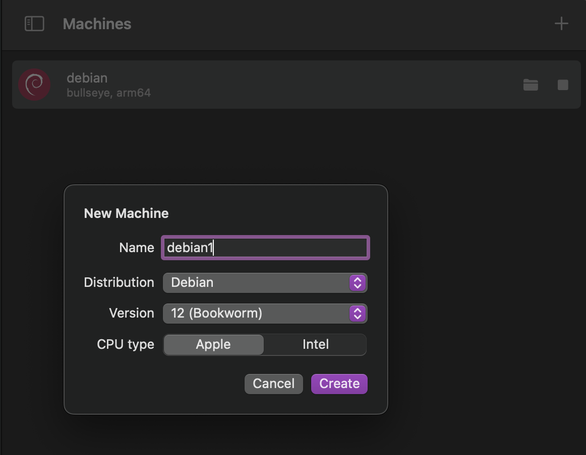
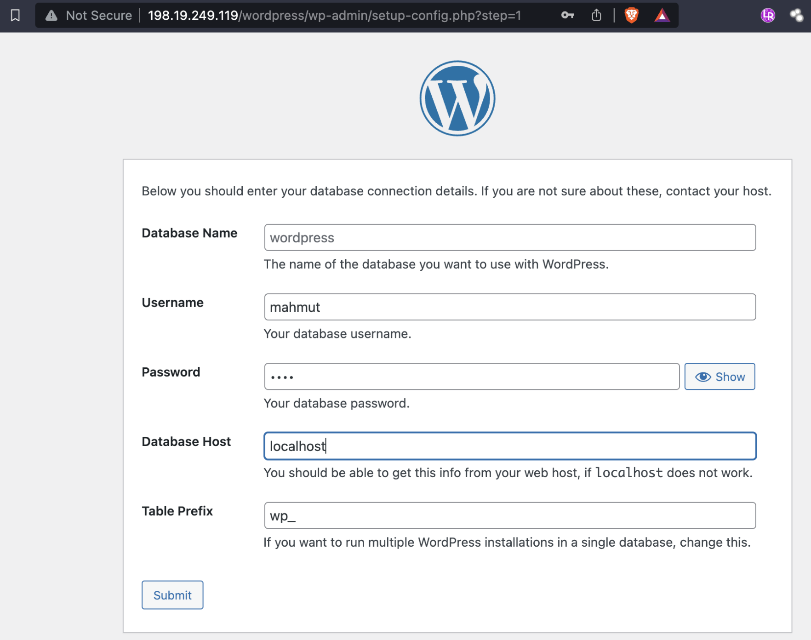
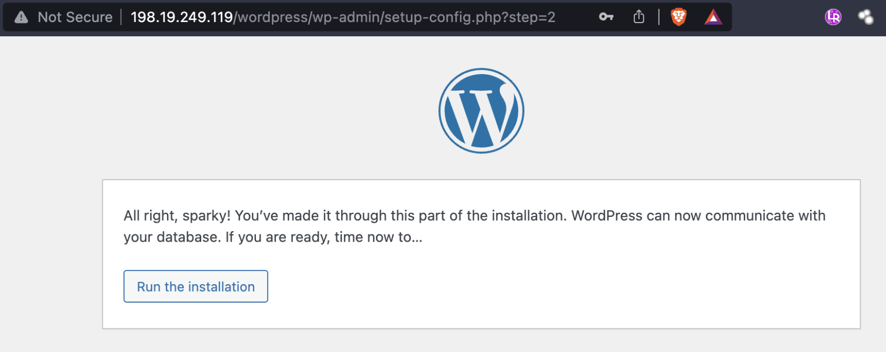
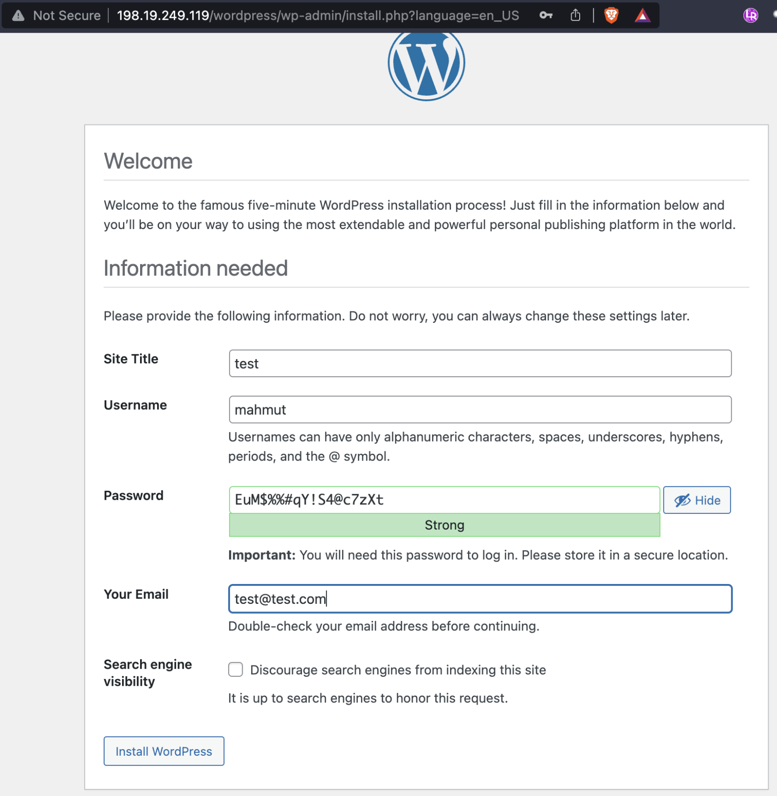
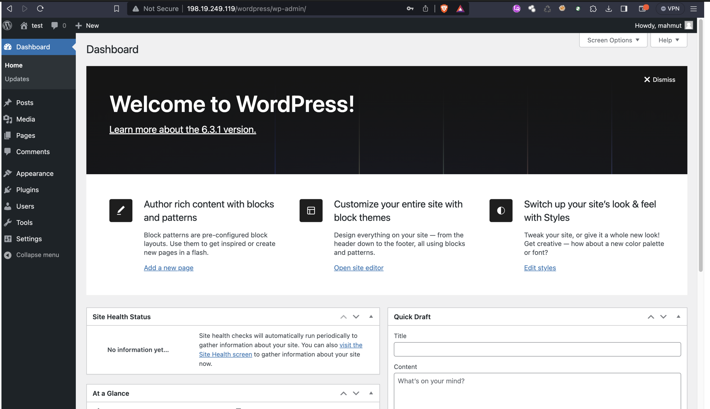

# Proje Raporu: Debian Üzerinde Apache ile WordPress Kurulumu

## Proje Özeti

Bu proje, Debian işletim sistemi üzerine Apache web sunucusu kullanarak bir WordPress web sitesi kurulumunu içermektedir. Aşağıda, projenin adım adım nasıl gerçekleştirildiği ve sonuçlarının açıklanması bulunmaktadır.

## Adım 1: Sunucu Hazırlığı

Orbstack üzerine Debian işletim sistemi yüklendi.

İşletim sistemi güncellemeleri almak için:
```
 sudo apt update 
 sudo apt upgrade 
 ```
komutları kullanıldı.
## Adım 2: Gerekli Paketlerin Kurulumu

Apache web sunucusu, MariaDB veritabanı, PHP ve ilgili modüller yüklemek için aşağıdaki komut kullanıldı:
```
sudo apt install apache2 mariadb-server php7.4 libapache2-mod-php7.4 php7.4-common php7.4-mbstring php7.4-xmlrpc php7.4-soap php7.4-gd php7.4-xml php7.4-intl php7.4-mysql php7.4-cli php7.4-ldap php7.4-zip php7.4-curl
```
## Adım 3: MySQL Güvenlik Ayarları

MySQL güvenlik ayarlarını yapılandırmak için:
```
 sudo mysql_secure_installation 
 ```
komutu kullanıldı.
## Adım 4: WordPress İndirme ve Yükleme

WordPress'in son sürümü indirilmek için:
```
cd  /tmp/ 
```
dizinine gidildi ve:
```
 wget https://wordpress.org/latest.tar.gz
 ```
 komutu kullanıldı.
İndirilen dosya:
```
tar -xvzf latest.tar.gz
```
 çıkartıldı ve WordPress klasörü:
 ```
 sudo mv wordpress/ /var/www/html/
 ```
 dizinine taşındı.
 ## Adım 5: İzin ve Sahiplik Ayarları

WordPress dosyalarına gerekli izinler verildi ve sahiplik değiştirildi:
```
sudo chmod 755 -R /var/www/html/wordpress/
sudo chown -R www-data:www-data /var/www/html/wordpress/
```
## Adım 6: Apache Konfigürasyonu

WordPress için Apache VirtualHost konfigürasyonu yapıldı. /etc/apache2/sites-available/wordpress.conf dosyası oluşturuldu ve etkinleştirildi:
```
sudo vi /etc/apache2/sites-available/wordpress.conf
sudo a2ensite wordpress
```
## Adım 7: Apache Modül Aktivasyonu

Apache'nin yeniden yönlendirme (rewrite) modülü aktive edildi:
```
sudo a2enmod rewrite
```
## Adım 8: Apache Sunucusunun Yeniden Başlatılması

Apache web sunucusu yeniden başlatıldı:
```
sudo systemctl restart apache2
```
## Adım 9: Sunucu IP Adresinin Alınması

Sunucunun IP adresi alındı:
```
ip -a
```





## Sonuçlar

Bu projenin sonucunda, Debian üzerinde başarılı bir şekilde Apache web sunucusu ile çalışan bir WordPress web sitesi kuruldu. Web sitesi, sunucunun IP adresi kullanılarak erişilebilir hale geldi.


