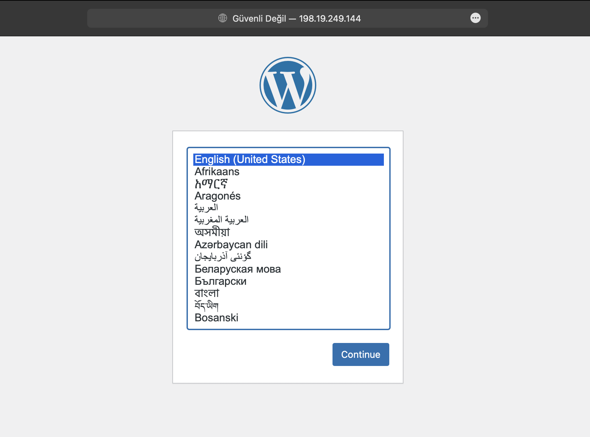
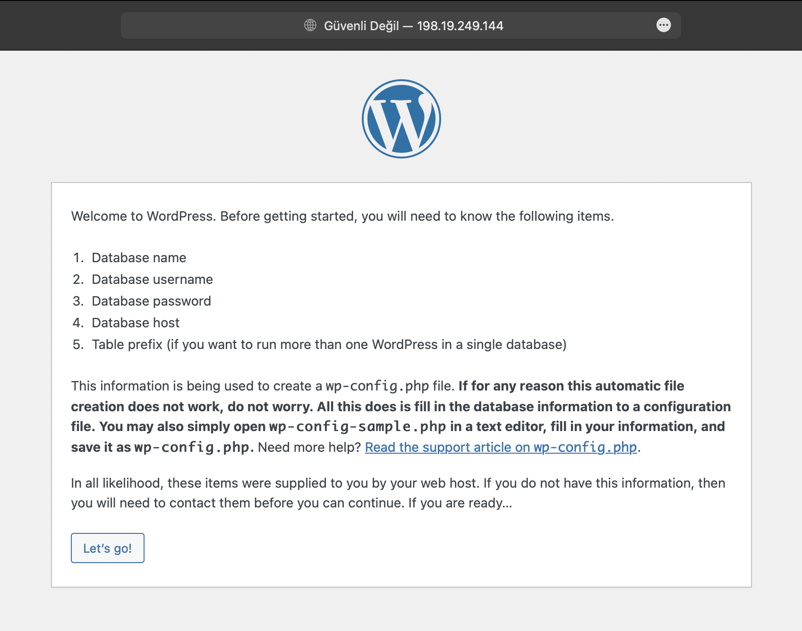
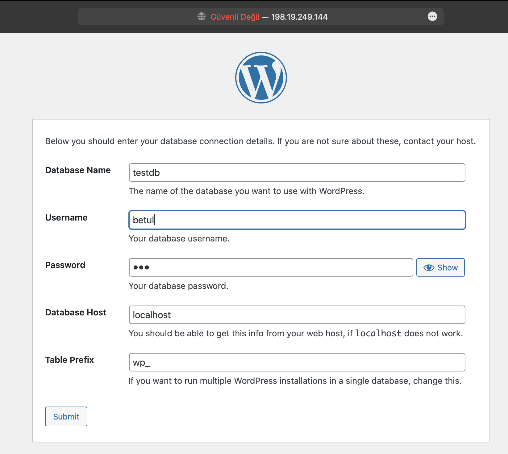
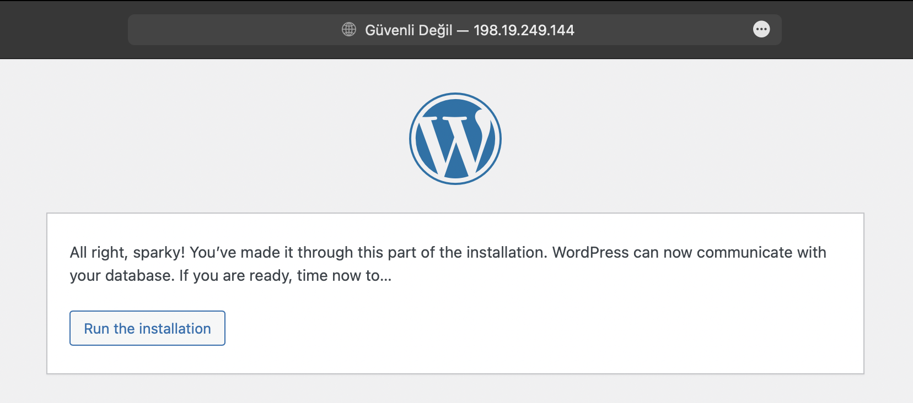
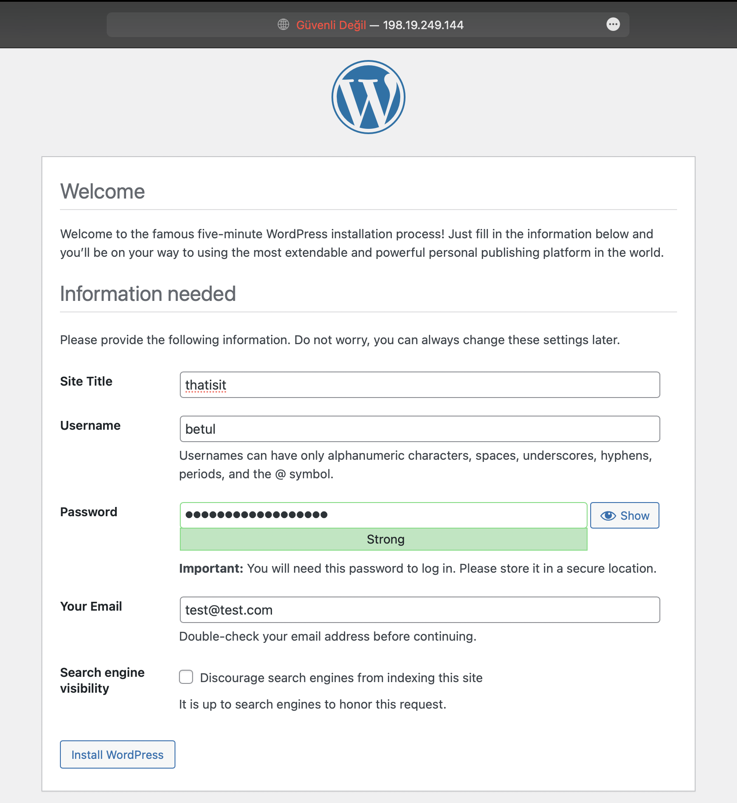
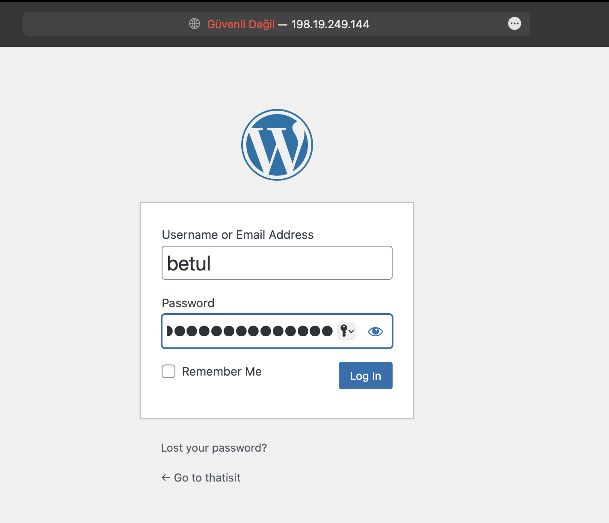
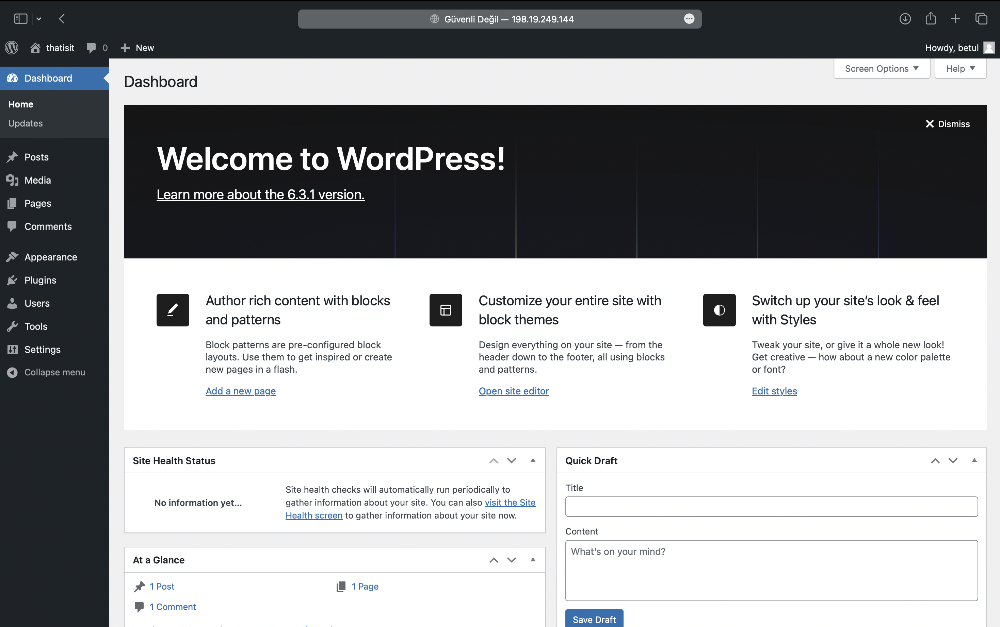

# Proje Raporu: Debian 12.1.0 Üzerinde Apache Web Servisi ile WordPress Kurulumu

## Proje Özeti

Bu proje, Debian 12.1.0 işletim sistemi üzerine Apache web servisi kullanarak bir WordPress web sitesi kurulumunu içermektedir. Aşağıda, projenin adım adım nasıl gerçekleştirildiği ve sonuçlarının açıklanması bulunmaktadır.

## Adım 1: Gerekli Paketlerin Kurulumu

Apache web servisi kurulumu
```
sudo apt install apache2
```
 MariaDB veritabanı kurulumu
```
sudo apt install  mariadb-server
```
 PHP, Apache'nin PHP dosyalarını işlemesine izin veren libapache2-mod-php paketi ve MySQL veritabanlarına erişim sağlamak için php-mysql pakiti kurulumu
```
sudo apt install php libapache2-mod-php  php-mysql
```
## Adım 2: MySQL Güvenlik Ayarları

MySQL veritabanının güvenlik ayarlarını yapılandırması:
```
 sudo mysql_secure_installation 
 ```
Güvenlik ayarları için soruların cevaplanması:
```
Switch to unix_socket authentication [Y/n] y

Enter current password for root (enter for none):

Change the root password? [Y/n] n

Remove anonymous users? [Y/n] y

Disallow root login remotely? [Y/n] y

Remove test database and access to it? [Y/n] y

Reload privilege tables now? [Y/n] y
```

MariaDB konsoluna erişilmesi:

```
sudo mysql -u root -p
```
Yeni bir veritabanı oluşturulması
```
MariaDB [(none)]> CREATE DATABASE testdb;
```
Oluşturulan veritabanının izinlerine sahip yeni bir kullanıcı ve şifre oluşturulması
```
MariaDB [(none)]> GRANT ALL PRIVILEGES on testdb.* TO 'betul'@'localhost' IDENTIFIED BY '123';
```
Veritabanındaki izinlerin yenilenmesi
```
MariaDB [(none)]> FLUSH PRIVILEGES;
```
Son olarak mariadb konsolundan çıkılması
```
MariaDB [(none)]> exit
```

## Adım 3: WordPress İndirme ve Yükleme

Bu adımlarla sıkıştırılmış WordPress dosyaları geçici dosyaların bulunduğu dizin olan /tmp/ altına indirilir ardından çıkarılır ve Apache tarafından kullanılacak olan /var/www/html/ dizinine taşınır.
```
cd  /tmp/ 
```
```
 wget https://wordpress.org/latest.tar.gz
 ```
İndirilen dosya:
```
tar -xvzf latest.tar.gz
```
Komutu ile çıkartılıp ve wordpress klasörünün /var/www/html/ dizinine taşınır:
 ```
 sudo mv wordpress/ /var/www/html/
 ```
 
 ## Adım 4: İzin ve Sahiplik Ayarları

WordPress dosyalarına gerekli izinler verilip ve sahipliğin değiştirilmesi:
```
sudo chmod 755 -R /var/www/html/wordpress/
sudo chown -R www-data:www-data /var/www/html/wordpress/
```
## Adım 5: Apache Konfigürasyonu

WordPress için Apache VirtualHost konfigürasyonu yapılıp /etc/apache2/sites-available/wordpress.conf dosyası oluşturulması:
```
sudo vi /etc/apache2/sites-available/wordpress.conf
```
Konfigürasyon dosyasının içeriği:
```
<VirtualHost *:80>
     ServerAdmin admin@myblog
      DocumentRoot /var/www/html/wordpress
     ServerName myblog

     <Directory /var/www/html/wordpress>
          Options FollowSymlinks
          AllowOverride All
          Require all granted
     </Directory>

     ErrorLog ${APACHE_LOG_DIR}/myblog_error.log
     CustomLog ${APACHE_LOG_DIR}/myblog_access.log combined

</VirtualHost>
```

wordpress virtual host'un etkinleştirilmesi:
```
sudo a2ensite wordpress
```
## Adım 8: Apache Modül Aktivasyonu

Apache'nin yeniden yönlendirme (rewrite) modülünün aktive edilmesi:
```
sudo a2enmod rewrite
```
## Adım 9: Apache Sunucusunun Yenilenmesi 

Apache web servisinin yenilenmesi:
```
sudo systemctl reload apache2
```
## Adım 10: Sunucu IP Adresinin Alınması

Sunucunun IP adresinin alınması:
```
ip -a
```
Alınan ip kullanılarak web sitesine gidilmesi:


## Adım 11: Web arayüzü üzerinden kurulum yapılması















## Sonuçlar

Bu projenin sonucunda, Debian 12.1.0 işletim sistemi üzerinde başarılı bir şekilde Apache web servisi ile çalışan bir WordPress web sitesi kuruldu. Web sitesi, sunucunun IP adresi kullanılarak erişilebilir hale geldi.


