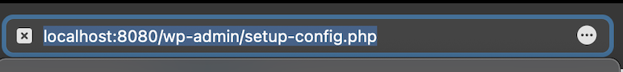
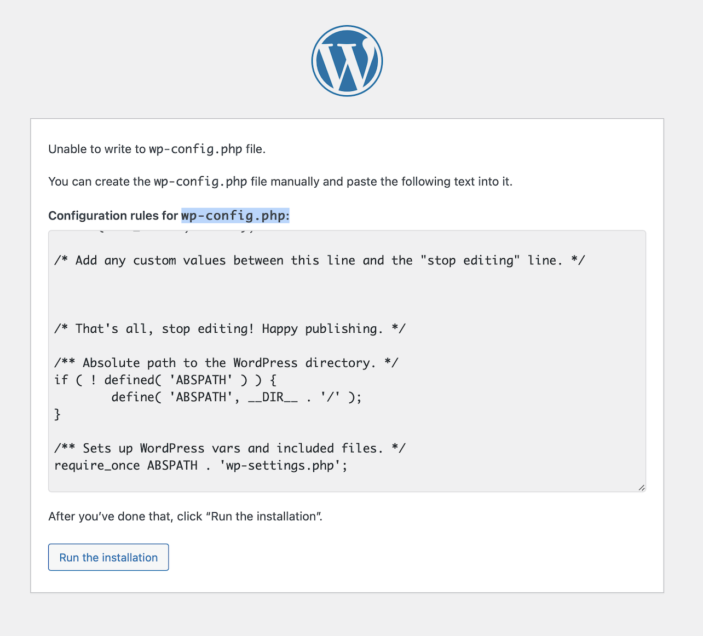
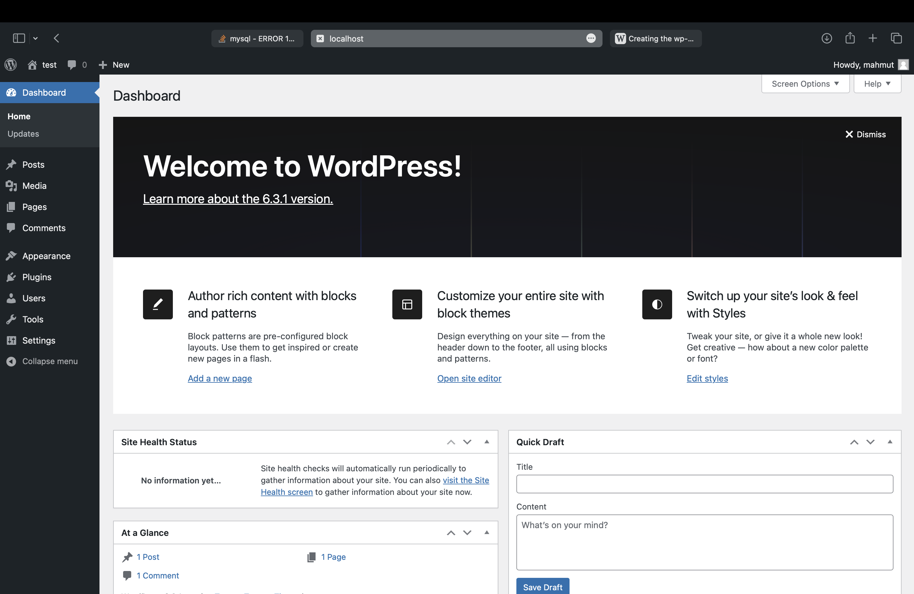

# Proje Rapor: Rocky Linux Üzerinde Apache ile WordPress Kurulumu
## Proje Özeti

Bu proje, Rocky işletim sistemi üzerine Apache web sunucusu kullanarak bir WordPress web sitesi kurulumunu içermektedir. Aşağıda, projenin adım adım nasıl gerçekleştirildiği ve sonuçlarının açıklanması bulunmaktadır.
## Adım 1: Apache Web Sunucusu Kurulumu
Bu komut, Apache HTTP sunucusunun kurulumunu başlatır.
```
dnf install httpd
```
## Adım 2: Firewall Ayarları
Bu komut, HTTP ve HTTPS portlarına gelen trafiği izin veren firewall kurallarını ekler.
```
firewall-cmd --add-port=443/tcp --permanent
firewall-cmd --add-port=80/tcp --permanent
```
## Adım 3: Apache Otomatik Başlatılması
Bu komut, sistem yeniden başlatıldığında Apache sunucusunun otomatik olarak başlamasını sağlar.
```
systemctl enable httpd
```
## Adım 4: PHP ve MySQL Kurulumu
Bu komut, MySQL veritabanı sunucusunun başlamasını ve otomatik başlatılmasını sağlar.
```
dnf install php php-mysqlnd mysql-server
```
```
systemctl enable --now mysqld
```
```
systemctl enable --now mysql
```
## Adım 6: MySQL Root Kullanıcısının Parolasının Ayarlanması
Bu adımla MySQL veritabanı sunucusuna giriş yapılır ve root kullanıcısı için bir parola belirlenir.
```
mysql
```
```
mysql -u root -p
exit
````
## Adım 7: MySQL Güvenlik Kurulumu
Bu komutla MySQL güvenlik kurulumu başlatılır ve bir dizi güvenlik adımı izlenir.
```
mysql_secure_instalation
````
```
mysql
mysql 'root'@'localhost' 
mysql -h root -p
exit
```
## Adım 8: WordPress İndirilmesi ve Taşınması
Bu adımlarla WordPress dosyaları indirilir, çıkarılır ve Apache tarafından kullanılacak olan /var/www/html/ dizinine taşınır.
```
wget http://WordPress.org/latest.tar.gz
```
```
 tar -xzvf latest.tar.gz
 ```
 ```
mv wordpress/* /var/www/html/
```
## Adım 9: Dosya İzinleri Ayarları
Bu komut, WordPress dosyalarının Apache kullanıcısı tarafından okunabilir ve yazılabilir olduğundan emin olmak için dosya izinlerini düzenler.
```
chown -R apache:apache /var/www/html/
```
## Adım 10: Varsayılan Hoş Geldiniz Sayfasının Devre Dışı Bırakılması
Bu komut, Apache web sunucusunun varsayılan hoş geldiniz sayfasını devre dışı bırakır.
```
vim /etc/httpd/conf.d/welcome.conf
```
## Adım 11: Apache Sunucusunun Yeniden Başlatılması ve İzin Ayarları
Bu adımlarla Apache sunucusu yeniden başlatılır ve dosya izinleri ayarlanır.
```
systemctl restart httpd
```
```
chcon -t httpd_sys_rw_content_t /var/www/html/ -R
restorecon -Rv /var/www/html/ 
```
## Adım 12: Firewall Kuralları Güncellenmesi
Bu komutlarla HTTPS trafiği için firewall kurallarını günceller ve güncellemeler uygulanır.
```
firewall-cmd --permanent --zone=public --add-service=https
```
```
systemctl reload firewalld
```


## Adım 13: WordPress Yapılandırma Dosyasının Oluşturulması 

Bu adımlarla WordPress yapılandırma dosyası oluşturulur ve kopyalanır.
```
vim wp-config-sample.php
cp -r wp-config-sample.php wp-config.php
```



