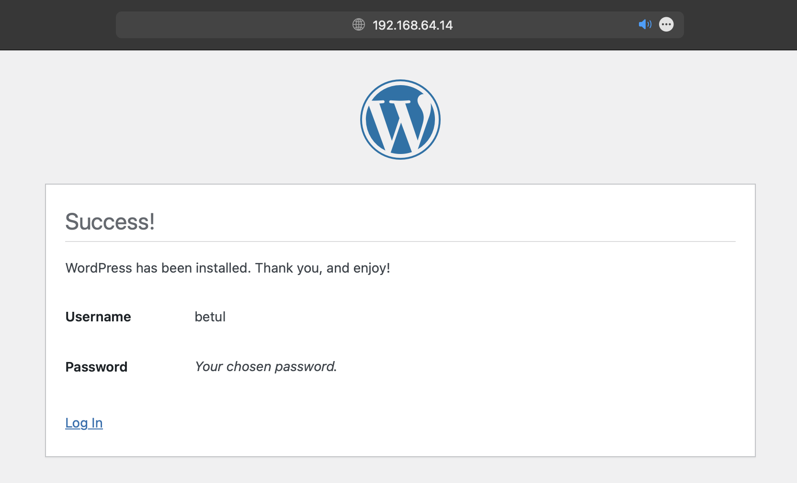

# Proje Raporu: Rocky 9.2 Üzerinde Apache web server ile WordPress Kurulumu
## Proje Özeti

Bu proje, Rocky 9.2 işletim sistemi üzerine Apache web servisi kullanarak bir WordPress web sitesi kurulumunu içermektedir. Aşağıda, projenin adım adım nasıl gerçekleştirildiği ve sonuçlarının açıklanması bulunmaktadır.
## Adım 1: Apache Web Servisinin Kurulumu
Bu komut, Apache web servisinin kurulumunu başlatır.
```
dnf install httpd
```

## Adım 2: Firewall Ayarları
Bu komut, HTTP ve HTTPS portlarına gelen trafiği izin veren firewall kurallarını ekler.
```
firewall-cmd --add-port=443/tcp --permanent
firewall-cmd --add-port=80/tcp --permanent
```

## Adım 3: Apache Web Servisinin Otomatik Başlatılması
Bu komut, sistem yeniden başlatıldığında Apache web servisinin otomatik olarak başlamasını sağlar.
```
systemctl enable httpd
```
```
systemctl status httpd
```


## Adım 4: PHP ve MySQL Kurulumu
Bu komut, MySQL servisinin başlamasını ve otomatik başlatılmasını sağlar.
Aşağıda belirtilen indirme işleminde versiyon belirtilmediği için php ve mysql'in en son sürümü yüklenecektir.
```
dnf install php php-mysqlnd mysql-server
```
```
systemctl enable --now mysqld
```

## Adım 5: MySQL Güvenlik Kurulumu
Bu komutla MySQL güvenlik kurulumu başlatılır ve bir dizi güvenlik adımı izlenir.
```
mysql_secure_instalation
```
```
Press y|Y for Yes, any other key for No: y

There are three levels of password validation policy:
LOW    Length >= 8
MEDIUM Length >= 8, numeric, mixed case, and special characters
STRONG Length >= 8, numeric, mixed case, special characters and dictionary file
Please enter 0 = LOW, 1 = MEDIUM and 2 = STRONG: 0

New password: 

Re-enter new password: 

Estimated strength of the password: 50 
Do you wish to continue with the password provided?(Press y|Y for Yes, any other key for No) : y

Remove anonymous users? (Press y|Y for Yes, any other key for No) : y

Disallow root login remotely? (Press y|Y for Yes, any other key for No) : n

Remove test database and access to it? (Press y|Y for Yes, any other key for No) : y

Reload privilege tables now? (Press y|Y for Yes, any other key for No) : y

```

MariaDB konsoluna erişilmesi:
```
mysql -u root -p
```
Yeni bir veritabanı oluşturulması
```
mysql> CREATE DATABASE betuldb;
```
Yeni bir kullanıcı ve şifre oluşturup , veritabanı izinlerinin verilmesi
```
mysql> CREATE USER 'betul'@'localhost' IDENTIFIED BY '1q2w3e4r';
```
```
mysql> GRANT ALL ON betuldb.* TO `betul`@`localhost`;
```
Veritabanındaki izinlerin yenilenmesi
```
mysql> FLUSH PRIVILEGES;
```
Son olarak mysql konsolundan çıkılması
```
mysql> exit
````

## Adım 6: WordPress İndirilmesi ve Taşınması
Bu adımlarla sıkıştırılmış WordPress dosyaları geçici dosyaların bulunduğu dizin olan /tmp/ altına indirilir ardından çıkarılır ve Apache tarafından kullanılacak olan /var/www/html/ dizinine taşınır.
```
cd  /tmp/ 
wget http://WordPress.org/latest.tar.gz
```
```
 tar -xzvf latest.tar.gz
```
```
mv wordpress/* /var/www/html/
```

## Adım 7: Dosya İzinleri Ayarları
Bu komut, WordPress dosyalarının Apache kullanıcısı tarafından okunabilir ve yazılabilir olduğundan emin olmak için dosya izinlerini düzenler.
```
chown -R apache:apache /var/www/html/
```
```
chcon -t httpd_sys_rw_content_t /var/www/html/ -R
restorecon -Rv /var/www/html/ 
```

## Adım 8: Apache Servisinin Yenilenmesi 
Bu adımlarla Apache srvisinin yenilenir.
```
systemctl reload httpd
```

## Adım 9: Firewall Kuralları Güncellenmesi
Bu komutlarla HTTPS trafiği için firewall kurallarını günceller ve güncellemeler uygulanır.
```
firewall-cmd --permanent --zone=public --add-service=https
```
```
systemctl reload firewalld
```

## Adım 10: Sunucu IP Adresinin Alınması

Sunucunun IP adresinin alınması:
```
ip -a
```
Alınan ip kullanılarak web sitesine gidilmesi


## Adım 11: WordPress Yapılandırma Dosyasının Oluşturulması 


Bu adımlarla WordPress yapılandırma dosyası oluşturulur.
```
vim wp-config.php
```
wp-config.php dosyasının içeriği aşağıda belirtildiği gibi düzenlenmiştir;





## Sonuçlar

Bu projenin sonucunda, Rocky 9.2 işletim sistemi üzerinde başarılı bir şekilde Apache web servisi ile çalışan bir WordPress web sitesi kuruldu. Web sitesi, sunucunun IP adresi kullanılarak erişilebilir hale geldi.


